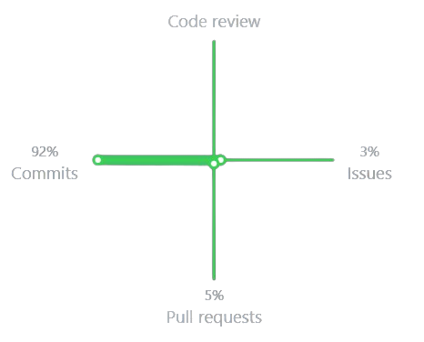

Listing down my contribution graphs, skylines from 2018 to till date! :-)

<details open>
<summary>2021 (Updating) </summary>
   


Contribution Skyline:
   
```    

            ✦   ▁          ✧✧                    ☽   
✧            ✧  █     ✦   ✧          ✧               
 ✧              █  ✦                                ✧
✦       ✧✦▄▂    █✦   ✦                               
      ▇▄  ███▇▄ █▃                   ✦           ✦   
█▁▆▆▅▁██▇██████▅██▁▁▁▁▁▁▁▁▁▁▁▁▁▁▁▁▁▁▁▁▁▁▁▁▁▁▁▁▁▁▁▁▁▁▁
  
```
Contribution Graph:



</details>

<details close>
<summary>2020</summary>
   
  
```
      ✧ ✦      ✧         ✧ ✧         ✧ ✧  ✦▁      ✧  
      ✧        █         ✧ ✧  ▂    ✦    ▂  █         
       ✦    ▄☽ █ █  ▂        ✦█▃✧    ✧  █ ██✦▆       
            █▂▃█▁█▆ █▆  ✦   ▁▂██▁▂    ▁▅█ ██▇█     ✧ 
            ███████▂██▄ ▄█▃███████▃  ▂███▇████▇▇ ▇   
▇▁▁▁▁▁▇▁▅▁▁▇███████████▁███████████▁▁███████████▇█▇▇▅
  
```
Contribution Graph:


</details>

<details close>
<summary>2019</summary>
   
   

```        

                                 ▁☽ ✦   ✧          ✦ 
                           ✦✦    █                  ✦
                              ✧  █          ✦      ✧ 
                        ✦     ▁  █                   
✦                            ▃█  █   ▅ ▇        ▁    
▁▁▁▁▁▁▁▁▁▁▁▁▁▁▁▁▁▁▁▁▁▁▁▁▁▁▁▁▁██▅▁█▅▁▅█▅█▅▅▁▁▁▁▁▁█▅▅▁▁
```

Contribution Graph:


</details>

<details close>
<summary>2018</summary>
 
   
  
```            

     ✦     ✦     ☽       ✦ ✧      ▁                  
  ✦  ✧   ✦                        █                  
       ✦           ✦              █                  
   ✧                              █✦    ✦     ✧✧     
✦                       ✧✦        █ ✧  ✧             
▁▁▁▁▁▁▁▁▁▁▁▁▁▁▁▁▁▁▅▁▁▁▁▁▁▁▁▁▁▁▁▁▁▁█▁▁▁▁▁▁▁▁▁▁▁▁▁▁▁▁▁▁

```
</details>
